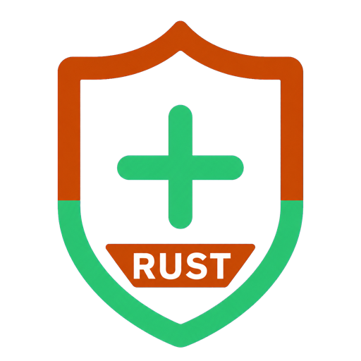

<p align="center">
	
</p>
<h1 align="center" style="margin: 30px 0 30px; font-weight: bold;">Sa-Token-Rs v0.1.0</h1>
<h5 align="center">✨ 开源、免费、一站式 Rust 权限认证框架，让鉴权变得简单、优雅！</h5>
<p align="center" class="badge-box">
	<a href="https://github.com/easy-4-rust/sa-token-rs"></a>
	<a href="https://github.com/easy-4-rust/sa-token-rs/blob/main/LICENSE"></a>
	<a href="https://sa-token.cc"></a>
</p>

---

## 📝 前言：️️

为了保证新同学不迷路，请允许我唠叨一下：

- **Java 原版最新开发文档**永远在：[https://sa-token.cc](https://sa-token.cc)
- **本站为 Sa-Token-Rs（Rust）文档**，路径：`crates/sa-token-doc`，结构与 Java 文档一一对应。

回望 Java 版 Sa-Token 的设计：市面上缺少的不仅是一个简洁好用的鉴权框架，更是一整套清晰、自洽的权限架构设计思想。Sa-Token-Rs 正是将该思想移植到 Rust，保持 API 语义对齐，同时拥抱 Cargo / axum / actix-web / serde。

用心阅读文档，你学习到的将不止是 Sa-Token-Rs 框架本身，更是绝大多数场景下权限设计的最佳实践。适配约定见：[文档适配说明](/DOC_ADAPTATION)。


## 🛠️ Sa-Token-Rs 介绍

**Sa-Token-Rs** 是 [Sa-Token](https://sa-token.cc) 的 Rust 一比一移植版，主要解决：**登录认证**、**权限认证**、**单点登录**、**OAuth2.0**、**分布式 Session 会话**、**微服务网关鉴权**
等一系列权限相关问题。

| Java Sa-Token | Sa-Token-Rs |
|---|---|
| Spring Boot | axum（`sa-token-web-axum`） |
| WebFlux | axum + tokio |
| Solon / Quarkus | actix-web（`sa-token-web-actix`） |
| Maven / Jackson | Cargo / serde |

<!--  -->

<object class="sa-token-jss-img" data="/big-file/index/intro/sa-token-jss--tran--onclick.svg"></object>

Sa-Token-Rs 旨在以简单、优雅的方式完成系统的权限认证部分，以登录认证为例，你只需要：

``` rust
// 会话登录，参数填登录人的账号 id
StpUtil::login("10001")?;
```

无需实现任何 trait，无需创建任何配置文件，只需要这一句静态代码的调用，便可以完成会话登录认证。

如果一个接口需要登录后才能访问，我们只需调用以下代码：

``` rust
// 校验当前客户端是否已经登录，如果未登录则返回 Err（对应 Java NotLoginException）
StpUtil::check_login()?;
```

在 Sa-Token-Rs 中，大多数功能都可以一行代码解决：

踢人下线：

``` rust
// 将账号 id 为 10077 的会话踢下线
StpUtil::kickout("10077")?;
```

权限认证：

``` rust
// 注解鉴权：只有具备 `user:add` 权限的会话才可以进入方法
#[sa_check_permission("user:add")]
async fn insert(/* user */) -> &'static str {
    // ...
    "用户增加"
}
```

路由拦截鉴权：

``` rust
// 根据路由划分模块，不同模块不同鉴权（axum 示意）
// 公开登录路由不加鉴权；业务路由内 check_permission / Layer
async fn user_api() -> SaResult<&'static str> {
    StpUtil::check_permission("user")?;
    Ok("ok")
}
async fn admin_api() -> SaResult<&'static str> {
    StpUtil::check_permission("admin")?;
    Ok("ok")
}
```

当你受够繁琐的鉴权样板代码之后，你就会明白，Sa-Token-Rs 的 API 设计是多么的简单、优雅！


## 🎉 Sa-Token-Rs 功能一览

Sa-Token-Rs 目前主要五大功能模块：登录认证、权限认证、单点登录、OAuth2.0、微服务鉴权。

- **登录认证** —— 单端登录、多端登录、同端互斥登录、七天内免登录。
- **权限认证** —— 权限认证、角色认证、会话二级认证。
- **踢人下线** —— 根据账号id踢人下线、根据Token值踢人下线。
- **注解式鉴权** —— 优雅的将鉴权与业务代码分离（`#[sa_check_*]`）。
- **路由拦截式鉴权** —— 根据路由拦截鉴权，可适配 restful 模式。
- **Session会话** —— 全端共享Session,单端独享Session,自定义Session,方便的存取值。
- **持久层扩展** —— 可集成 Redis，重启数据不丢失。
- **前后台分离** —— APP、小程序等不支持 Cookie 的终端也可以轻松鉴权。
- **Token风格定制** —— 内置多种 Token 风格，还可：自定义 Token 生成策略。
- **记住我模式** —— 适配 [记住我] 模式，重启浏览器免验证。
- **二级认证** —— 在已登录的基础上再次认证，保证安全性。
- **模拟他人账号** —— 实时操作任意用户状态数据。
- **临时身份切换** —— 将会话身份临时切换为其它账号。
- **同端互斥登录** —— 像QQ一样手机电脑同时在线，但是两个手机上互斥登录。
- **账号封禁** —— 登录封禁、按照业务分类封禁、按照处罚阶梯封禁。
- **密码加密** —— 提供基础加密算法能力。
- **会话查询** —— 提供方便灵活的会话查询接口。
- **Http Basic认证** —— 接入 Http Basic、Digest 认证。
- **全局侦听器** —— 在用户登陆、注销、被踢下线等关键性操作时进行一些 AOP 操作。
- **全局过滤器** —— 方便的处理跨域，全局设置安全响应头等操作（Layer / Middleware）。
- **多账号体系认证** —— 一个系统多套账号分开鉴权（比如商城的 User 表和 Admin 表）
- **单点登录** —— 内置多种单点登录模式。
- **单点注销** —— 任意子系统内发起注销，即可全端下线。
- **OAuth2.0认证** —— 轻松搭建 OAuth2.0 服务。
- **分布式会话** —— 提供共享数据中心分布式会话方案。
- **微服务网关鉴权** —— 适配常见网关 / 反向代理场景的路由拦截认证。
- **临时Token认证** —— 解决短时间的 Token 授权问题。
- **独立Redis** —— 将权限缓存与业务缓存分离。
- **Quick快速登录认证** —— 为项目快速注入登录能力。
- **标签方言** —— Askama / Tera 模板集成（对应 Java Thymeleaf / FreeMarker）。
- **jwt集成** —— 提供 jwt 集成方案，提供 token 扩展参数能力。
- **参数签名** —— 提供跨系统 API 调用签名校验模块。
- **自动续签** —— 提供 Token 过期策略，灵活搭配使用，还可自动续签。
- **开箱即用** —— 提供 axum、actix-web、salvo 等常见框架集成包，开箱即用。
- **最新技术栈** —— MSRV Rust 1.88+，Edition 2024。

功能结构图：


## 📖❓ 疑问解答

**1、Sa-Token-Rs 功能全不全？**

对齐 Java 五大核心模块(登录、鉴权、SSO、OAuth2、微服务) + 众多实用插件 (短 token、jwt 集成、API 参数签名、API Key 秘钥授权...) —— 我们提供的不只是权限认证，我们提供的是一站式解决方案。


**2、Sa-Token-Rs 学习不好学？**

中文文档（本站与 Java 原版结构一致）+ 中文代码注释 + 大量 `sa-token-demo-*` 可运行示例。


**3、和 Java 版是什么关系？**

Sa-Token-Rs 是语义对齐的 Rust 实现；权限设计思想、文档章节、API 命名均向 Java 原版看齐，便于双栈团队协作。Java 热度与荣誉数据见原站：[https://sa-token.cc](https://sa-token.cc)。


**4、Sa-Token-Rs 收费吗？**

采用 Apache-2.0 开源协议，承诺框架本身与在线文档永久免费开放。赞助 Java 原版项目见：[赞助链接](https://sa-token.cc/doc.html#/more/sa-token-donate)。


**5、Sa-Token-Rs 是套壳其它鉴权库吗？**

不是。它与 Java Sa-Token 一样是独立实现的权限框架内核，并通过 `sa-token-web-*` 适配主流 Rust Web 框架。


## 🌍 其它语言版本

- **本文档即 Rust 版（本仓库）**：`sa-token-rs` / `crates/sa-token-doc`
- Java 原版：[https://sa-token.cc](https://sa-token.cc) / [https://github.com/dromara/sa-token](https://github.com/dromara/sa-token)
- 社区其它语言实现可参考 Java 文档「其它语言版本」章节。


## 📈 开源仓库

如果 Sa-Token-Rs 帮助到了您，希望您可以为其点上一个 `star`（本 monorepo）。

Java 原版 Star 趋势仍可参考：

[](https://starchart.cc/dromara/sa-token)


## 🚀 使用 Sa-Token 的开源项目

参考：[框架生态](/more/link)


## 📚 示例大全

**我们为框架几乎所有技术点均单独制作了对应的集成示例**：涵盖登录认证、权限认证、SSO、OAuth2、JWT、Redis、API Sign、API Key 等。

索引：[Sa-Token-Rs 集成示例大全](/more/download-demos)

运行示例：

```bash
cargo run -p sa-token-demo-axum
cargo run -p sa-token-demo-actix-web
```


## 💬 交流群

加入讨论群：[点击加入](/more/join-group.md)
