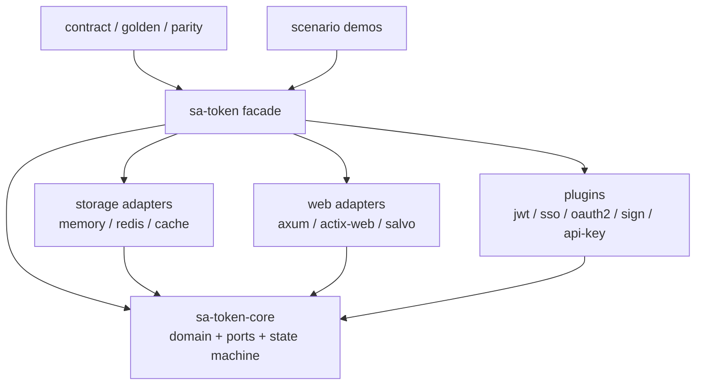

# Sa-Token 全量 Rust 迁移实施计划

## 1. 固定基线与统计口径

- Java 仓库：`/Users/wandl/workspaces/workspace-github/Sa-Token`
- Java 分支与提交：`dev@902886c2149261ccb53a9c982068b7ccd0990237`
- Java production 文件：895 个 `.java`
- 排除项：14 个 `package-info.java`
- 必须迁移的业务文件：881 个
- Rust 基础设施文件（`lib.rs`、`main.rs`、模块入口、测试、构建脚本和
  `xtask`）不计入 881 个业务文件。

迁移账本位于 [`docs/migration/file-map.csv`](migration/file-map.csv)。每一行记录
`java_file`、`rust_file`、`target_crate`、`rust_type`、`capability`、`status`、
`test_evidence` 和 `source_commit`。源路径和目标路径必须双向唯一。

## 2. 当前真实状态（2026-07-23）

| 指标 | 当前值 | 最终门槛 |
| --- | ---: | ---: |
| Java production 文件 | 895 | 895 |
| `package-info.java` 排除项 | 14 | 14 |
| 有效映射 | 881 | 881 |
| `complete` | 214 | 881 |
| `in_progress` | 118 | 0 |
| `planned` | 549 | 0 |
| 当前 crate 源文件（含基础设施） | 594 | 不作为验收口径 |
| `mod.rs` | 0 | 0 |
| 非 snake_case Rust 源文件 | 0 | 0 |

此前文档中的“180/180”和“119/119 全绿”未经全量账本和当前工作树验证，已删除。
当前 `complete` 表示目标路径已有真实实现且登记了可重复 `test_evidence`；未登记证据的已有代码仍记为
`in_progress`，不得虚报完成。

## 3. 已落实的工程基线

- workspace 使用 Edition 2024、resolver 3、MSRV 1.88。
- crate 目录保留 Cargo 标准 `kebab-case`；Rust 模块目录和文件统一
  `snake_case`，类型保持 `PascalCase`。
- 已切换到 `foo.rs + foo/`，清除全部 `mod.rs`。
- 已移除实际类型中的 `XInner + pub use XInner as X` 冲突规避模式。
- 已新增 `xtask` 的迁移矩阵生成、普通审计和严格审计命令；严格模式同时支持
  `migration-audit --strict` 与 `migration-audit-strict`，未知尾随参数会直接报错。
- 普通审计已验证 895/14/881 统计、双向唯一、命名和实际目录布局。
- 当前 workspace 在 Rust 1.88 和 stable 上通过全目标、全 feature check；
  Clippy `-D warnings` 通过；本轮含 FreeMarker→Tera 与 Thymeleaf→Askama 方言契约。

## 4. 目标 workspace 与依赖方向



约束：core 不依赖其他 workspace crate；storage、web adapter、plugin 只能向内
依赖 core；facade 使用最小默认 feature 定向导出；test 与 demo 位于最外层。
禁止反向测试依赖和 crate 环。

## 5. 分阶段实施

### 阶段 A：账本和结构基线

- [x] 锁定 Java 提交和 895/14/881 口径。
- [x] 生成 895 行机器可读账本并校验 881 个唯一目标。
- [x] 统一 snake_case 模块布局并清除 `mod.rs`。
- [x] 移除 `XInner` 类型别名模式。
- [~] 逐项审阅已有目标并补齐测试证据后才标记完成（本轮已收口注解 20 +
  SaManager/Listener/SaHolder/StpUtil 7；账本仍余 `in_progress` 118）。
  （本轮已完成注解 20 项 + SaManager/Listener/SaHolder/StpUtil 7 项；其余仍为
  `in_progress`。）

### 阶段 B：core 端口与隔离 runtime

- [x] 将 DAO 读操作收敛为 `SaResult<Option<T>>`，写操作为 `SaResult<()>`。
- [x] 引入对象安全的 `AsyncSaTokenDao`，异步端口使用显式错误传播。
- [x] 引入显式 `SaTokenRuntime` / `AsyncSaTokenRuntime` 容器；后续继续将门面
  算法迁移到 runtime。
- [x] 完成 application 四个文件的 Java 行为对齐：route prefix 裁剪、类型读取、
  lazy/set-by-null、TTL、keys 与 clear；审计中修复内存 DAO `search_data` 错返
  value 而非 key 的缺陷，并增加回归测试。
- [x] 完成 config 三个文件的基线对齐：Cookie nullable/default/extra attrs、
  `SaTokenConfig` 全字段与 Java 默认值、properties 工厂及 10021/10022 错误；
  修正 `isShare`、`maxLoginCount`、`isWriteHeader`、`isLog` 等历史默认值偏差。
- [x] 合并重复 `SaDisableWrapperInfo` 草稿，只保留矩阵指定的
  `model/wrapper_info/` 实现；恢复 disabled/time/level、构造器和 camelCase
  序列化契约。
- [x] 完成 Same-Token template/util：支持显式隔离 DAO/config、当前与 past token
  轮换、TTL、10301 错误和 manager 可替换默认模板；util 补齐无处理读取方法。
- [x] 完成 Router 三个文件：HTTP 方法覆盖 `CONNECT/ALL` 且非法输入保留 10321，
  匹配链保持惰性短路，`free` 仅捕获 `StopMatch`，顶层及链内 `stop/back` 使用
  显式 `Result` 控制流。
- [x] 完成 `fun` 根包及插件 hook 九个函数端口：纠正参数数量、泛型返回值和
  request/response/handler 边界，闭包可直接实现 trait；`IsRunFunction` 恢复为
  Java 对应的条件执行对象。
- [x] 实现显式 runtime 驱动的 `AsyncStpLogic` / `AsyncStpUtil` 高频登录契约，
  覆盖登录、注销、踢下线、顶人、设备、终端、TTL、角色、权限、封禁、二级认证
  和请求级身份切换；继续补齐共享/预定 Token、非并发替换、终端上限、
  Token-Session 与活跃超时，并验证两个 runtime 的状态隔离。
- [ ] `SaManager` 仅管理默认
  runtime，测试直接构造隔离实例。
- [ ] 完成登录、注销、踢下线、顶人、设备、权限、角色、安全认证、TTL、
  session 和异常传播的同步/异步契约测试。

### 阶段 C：存储、Web 与插件

- [x] Redis 切换为异步连接管理，使用分页 `SCAN`，实现保持 TTL 的原子更新，
  禁止生产路径 `KEYS` 和静默吞错。
- [x] 增加真实 Redis 集成测试，覆盖 TTL、SCAN、并发、坏序列化和连接超时。
- [x] 完成 Actix Web 4.14 与 Salvo 0.85 的异步 middleware/extractor/hoop、
  cookie/header 与错误响应基线；Axum 0.8 现有 adapter 测试继续通过。
- [x] 移除受 `RUSTSEC-2023-0071` 影响的 rust-rsa：core RSA 使用 OpenSSL，
  jsonwebtoken 使用 `aws_lc_rs` backend，并删除 cargo-deny 临时豁免。
- [x] 建立固定 Java 提交的 golden exporter 和首份 core defaults/key fixture，
  修复 session、disable、safe、switch key 与自定义 `token_name` parity 缺陷。
- [x] 接入 error code 与 5 个 serializer 实现；序列化错误显式传播，JSON byte API
  与 Java 一致保持禁用，Base64/Hex/ISO-8859-1 codec 通过 Java golden，其中 golden
  发现并修复了 Rust Hex 大小写不兼容。
- [x] `SaSerializerTemplate` 端口本身完成逐项验收：文本/字节、typed decode、
  null 传递与 malformed input 均有 serializer contract 证据。
- [x] core plugin 三文件完成生命周期验收：按具体类型去重、安装/销毁检查、
  before/override/after hook 一次消费、安装后注册 after hook 立即执行；Rust 使用
  静态注册替代 Java classpath SPI。
- [x] 完成 API Key 的 13 个 Java 文件逐项迁移；异步模板覆盖生成、持久化、缓存、
  account 索引、scope、归属校验和请求提取，插件生命周期与 Java golden 均有测试证据。
- [x] 完成 serializer-features 的 6 个 Java 文件逐项迁移；自定义、Emoji、元素
  周期表、特殊符号和天干字符表均通过字节契约与固定 Java golden 数据校验。
- [x] 完成 JWT 的 7 个 Java 文件逐项迁移；claims、毫秒 `eff`、HS256、三种运行
  模式和 30201–30206 错误码对齐，Rust 可验证固定 Java 提交生成的真实 Token。
- [x] 完成 Sign 的 11 个 Java 文件逐项迁移；canonical 字典序、digest、毫秒窗口、
  nonce 防重放、named appid、注解处理和错误码均有契约，MD5 输出通过 Java golden。
- [x] SSO 37/37 项完成：配置、模型、消息/handler、策略、隔离 manager、client/server
  template、util 与框架无关 processor 均已迁移；旧顶层重复实现已删除。Java golden
  覆盖 auth URL、嵌套 back 编码、ticket key 与 ticket-index key。
- [x] OAuth2 已完成 64/64 项：注解及处理器、OIDC/服务端配置、客户端与四类持久化
  token/code 模型、请求/ID Token 模型、转换器、授权模式与协议常量、完整错误码、
  九类结构化异常已精确映射；转换器使用显式 token 生成端口并保持 Java TTL、scope
  和模型转换语义。异步 DAO 覆盖 CRUD、FIFO/TTL 索引、scope/state/nonce，并通过
  Java key golden；隔离 loader 与异步生成器覆盖 openid/unionid、code 单次消费、
  refresh/client token、state 防重放和 redirect 构造。框架无关 resolver 覆盖参数、
  Basic/Bearer、授权请求和显式/隐藏响应结构；`SaOAuth2Manager` 以显式
  `SaOAuth2Runtime` 聚合配置、loader、resolver、converter、generator 和 DAO，
  测试可直接构造隔离实例；四类 token value、grant 认证和两类 scope 加工函数端口
  已独立映射并使用框架无关请求模型；确认授权视图、未登录视图与登录处理函数通过
  `serde_json::Value` 保留 Java `Object` 响应能力；CommonScope 和 openid、unionid、
  userid handler 已使用显式 loader 并传播 client 缺失错误；OIDC handler 通过显式
  context/signer 端口构造 claims，grant handler 全部使用 async DAO/generator 并覆盖
  authorization_code、password、refresh_token；隔离 strategy 注册 scope/grant
  handler，异步 template 负责 client、redirect、scope、token 与撤销校验，
  framework-neutral processor 覆盖 authorize/token/refresh/revoke/login/confirm/
  client-token 流程，plugin facade 将三类 OAuth2 注解处理器安装到显式 registry。
  旧顶层重复实现已删除，64 个目标文件均登记 OAuth2 foundation 测试证据。
- [ ] 完成 OAuth2 的 Java golden/parity 测试和安全审计。

### 阶段 D：starter 和 demo 职责迁移

- [ ] Spring、Servlet、Solon、JFinal、JBoot 等 Java 文件按上下文、拦截器、
  配置注入、路由鉴权、生命周期职责映射到通用 Web core 或具体 adapter。
- [ ] demo 按登录、权限、SSO、OAuth2、JWT、Redis、WebSocket 场景迁移，保留
  行为而非 Java 框架 API。
- [x] FreeMarker 方言样板：`sa-token-tera`（Tera）+ `sa-token-demo-tera`
  （Spring Boot→axum）；对应 7 项账本已标 `complete`。
- [x] Thymeleaf 方言样板：`sa-token-askama`（Askama）+ `sa-token-demo-askama`
  （Spring Boot→axum）；对应 7 项账本已标 `complete`。

### 阶段 E：881/881 收口

- [ ] 每项具备真实实现与可重复测试证据，将账本全部改为 `complete`。
- [ ] 普通与严格迁移审计均通过。
- [ ] Rust 1.88 与 stable 的全部 CI 门禁通过并发布最终质量报告。

## 6. 验收命令

```bash
cargo run -p xtask -- migration-audit
cargo run -p xtask -- migration-audit-strict
cargo fmt --all --check
cargo check --workspace --all-targets --all-features --locked
cargo clippy --workspace --all-targets --all-features --locked -- -D warnings
cargo test --workspace --all-targets --all-features --locked
cargo test --workspace --all-targets --all-features --locked
cargo +1.88.0 check --workspace --all-targets --all-features --locked
cargo +stable check --workspace --all-targets --all-features --locked
cargo doc --workspace --all-features --no-deps
cargo deny check
```

`migration-audit-strict` 在 881 项全部完成前应失败；这是一项防止虚报完成度的
硬门禁，不是当前阶段的缺陷。
